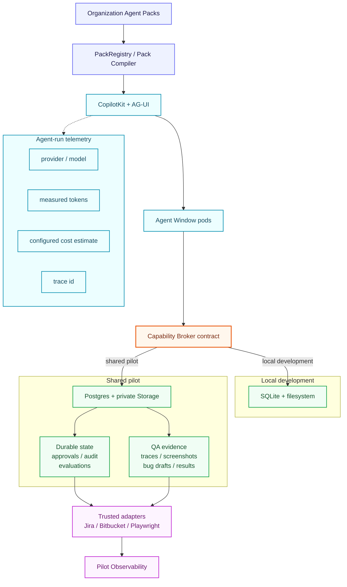
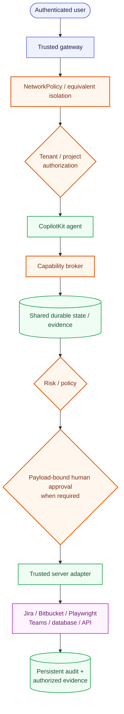

# BM Agents World

BM Agents World is the incubation repository for turning the organization agent packs under `packs/` into runnable, governed AI coworkers. The implementation is intentionally being stabilized here before it is merged into BM Agent Foundry.

## Current milestone: Phase 7 real QA team pilot

`apps/agent-window` uses CopilotKit + AG-UI as the agent experience layer and contains a real QA vertical slice plus a deployable, measurable, horizontally scalable shared-pilot package. Phase 7 adds the operational validation gate needed to put that package in front of a small real QA cohort.

What is working:

- Repository-driven agent pack discovery and one named CopilotKit agent per pack.
- Global BM Agents World supervisor for agent-pack discovery.
- QA runs as a multi-agent team: a supervisor plus scoped specialist agents (story context, change impact, test design, browser/API/database execution, integration traceability, defect investigation, and reporting).
- Pack task launcher and Copilot chat workspace.
- Governed capability broker with L0-L4 risk levels and payload-bound approvals.
- Centralized policy engine with local evaluation and OPA-backed shared-pilot enforcement.
- Organization-approved MCP/native connector registry with deny-unregistered admission and risk ceilings.
- OPA fail-closed behavior and execution-time policy re-evaluation.
- Real Jira story reads.
- Real Bitbucket change-impact reads.
- Story-aware, allowlisted project-test selection.
- Authenticated Playwright execution on approved non-production targets.
- Screenshot, trace, network, test-result, evidence-manifest, and bug-draft artifacts.
- Jira duplicate search.
- Real Jira defect creation behind L3 exact-artifact human approval.
- Same-run invariant: Jira duplicate search and bug creation require a bug draft produced by a real test run in the same run.
- Governed test-plan generation persisting immutable, story-scoped test-plan artifacts linked to the automated suite for traceability.
- Real Teams status posting through an approved, host-allowlisted server-side webhook.
- Allowlisted read-only database validation: server-curated named SQL, where the model supplies only a validation id (never SQL).
- Allowlisted read-only API contract checks (status, latency, JSON fields), where the model supplies only a contract id (never a URL).
- Run-scoped integration traceability correlating test plan, execution result, and bug draft with cross-step consistency checks.
- Executor capabilities that degrade to an honest mock instead of a fabricated success when their integration is not configured.
- Request-scoped tenant/project authorization and trusted-mode self-approval denial.
- Run-scoped artifact authorization.
- QA pilot observability derived from persistent execution facts.
- Persistent per-run human evaluation: outcome, usefulness, reuse intent, false positives, manual override time, and notes.
- AG-UI agent-run telemetry with measured token usage when provider metadata is present.
- Explicit measured/partial/unavailable model-usage coverage instead of fake zeroes.
- Configured token-rate cost estimates without hard-coded provider prices.
- OpenTelemetry spans for agent runs, governed capability execution, and approval decisions.
- Persistent capability execution latency and per-capability timing breakdowns.
- Local SQLite/filesystem persistence for developer workflows.
- Shared Postgres persistence for runs, actions, approvals, audit, evaluations, and model telemetry.
- Private Supabase Storage evidence repository for cross-pod QA workflows.
- Two-replica rolling-update Kubernetes pilot without a runtime data PVC.
- Host topology spreading, preferred pod anti-affinity, and a PodDisruptionBudget for the two-replica pilot.
- Health/readiness probes that validate shared state/evidence availability and centralized policy health in pilot mode.
- Phase 7 validation endpoint and CLI that require trusted identity, real-project readiness, shared persistence, healthy OPA, approved connectors, and multiple serving instances.
- Trusted-gateway-only ingress NetworkPolicy and no public Ingress.
- CI for strict TypeScript, policy/integration/deployment/observability/telemetry/shared-persistence tests, production build, and container build.

## Architecture



The pack files remain the source material. The core application must not become a separate hard-coded implementation for every organizational role.

### Repository map

```text
bm-agents-world/
├── apps/
│   └── agent-window/                 → CopilotKit + AG-UI application
│       └── src/
│           ├── client/               → Agent Window and QA pilot UI
│           └── server/
│               ├── platform/         → Capability, policy, persistence, and telemetry
│               └── qa/               → Jira, Bitbucket, Playwright, Teams, database, API, test-plan, and traceability adapters
├── packs/                            → Organization agent-pack source material
├── config/                           → Approved connector configuration
├── policies/                         → Central authorization policy
├── deploy/
│   ├── k8s/qa-pilot/                 → Shared pilot Kubernetes package
│   └── supabase/                     → Shared runtime schema
└── docs/                             → Architecture, operations, and pilot guides
```

## Run locally

Prerequisites:

- Node.js 22.13+
- An API key for the model provider selected in `AI_MODEL`

```bash
cp apps/agent-window/.env.example apps/agent-window/.env
npm install
npm run dev
```

The UI runs at `http://localhost:5173` and proxies API calls to the runtime on `http://localhost:4000`.

Local development defaults to:

```text
BM_IDENTITY_MODE=local-dev
BM_PERSISTENCE_MODE=sqlite-filesystem
```

Shared team deployments must use the trusted gateway model and shared persistence documented in `docs/qa-team-pilot-deployment.md` and `docs/shared-supabase-runtime.md`.

## QA shared pilot

The deployment package is under:

```text
deploy/k8s/qa-pilot/
```

The Phase 7 shared pilot uses:

```text
BM_DEPLOYMENT_MODE=pilot
BM_IDENTITY_MODE=trusted-headers
BM_PERSISTENCE_MODE=postgres-supabase
BM_POLICY_MODE=opa
BM_PILOT_PROJECT_IDS=PCC
BM_PILOT_REQUIRED_ENVIRONMENTS=playground,qa
BM_PILOT_EXPECTED_REPLICAS=2
replicas=2
RollingUpdate
```

Runtime state lives in the private `bm_agents_world` Postgres schema and QA evidence lives in a private Supabase Storage bucket. The Kubernetes base therefore does not mount a runtime data PVC.

Apply the shared database bootstrap before deployment:

```text
deploy/supabase/shared-runtime-schema.sql
```

Then create the private evidence bucket and provide the server-only Postgres/Supabase credentials through the deployment secret manager.

The Kubernetes base creates a `ClusterIP` service plus a NetworkPolicy that only permits explicitly labeled trusted-gateway pods in explicitly labeled gateway namespaces. There is intentionally no public Ingress. The deployment also spreads replicas across hosts when possible and protects one Ready instance with a PodDisruptionBudget.

Pilot probes and validation:

```text
GET /healthz
GET /readyz
GET /api/qa/pilot/validation   # trusted identity required
```

In shared pilot mode, readiness fails closed if Postgres, private artifact storage, OPA, or the approved connector registry is unavailable, in addition to the identity/model/Jira/Bitbucket/Playwright requirements.

After routing the deployment through the trusted gateway, validate the real pilot with:

```bash
BM_PILOT_BASE_URL=https://<trusted-gateway-host> npm run pilot:validate
```

The CLI repeatedly calls the trusted Phase 7 validation endpoint and fails unless it observes the configured number of distinct serving instances.

See:

- [QA Team Pilot Deployment](docs/qa-team-pilot-deployment.md)
- [Phase 7 Real QA Team Pilot](docs/qa-phase-7-real-team-pilot.md)
- [Shared Postgres + Supabase Storage Runtime](docs/shared-supabase-runtime.md)

## QA pilot scorecard

When the QA pack is selected, BM Agents World renders a Team Pilot Scorecard built from persisted execution facts and human feedback. It tracks run/action success, browser test pass/fail, approvals, bug drafts, confirmed Jira side effects, usefulness, would-use-again rate, false-positive defects, manual override time, model usage, configured cost estimates, and capability latency.

Model usage is reported only when numeric provider/AG-UI metadata is present. A workflow can therefore be `measured`, `partial`, or `unavailable`; missing usage is never reported as zero. Cost remains unavailable unless validated input/output token rates are explicitly configured server-side.

See [QA Pilot Observability and Evaluation](docs/qa-pilot-observability.md) and [Model Usage Telemetry and OpenTelemetry](docs/model-usage-opentelemetry.md).

## Security boundary

External capability execution follows:



Postgres credentials, Supabase secret keys, Jira/Bitbucket/model-provider credentials, Playwright authentication material, Teams webhook URLs, database connection strings, and API tokens remain server-side and must not enter model context. Database, API-contract, and browser execution run only server-curated, allowlisted work; the model supplies identifiers, never SQL, URLs, selectors, or scripts. Private Storage objects are returned only through the BM authorization boundary; the shared persistence implementation does not expose public or signed evidence URLs to the employee UI.

Free-form production mutation remains unavailable.

## Current constraints

- Phase 7 still requires environment-specific provisioning of the `bm_agents_world` Postgres schema, private Supabase Storage bucket, organization SSO/gateway route, and real PCC credentials/URLs before the validator can pass.
- Local SQLite/filesystem mode remains single-process and must not be used as independent state across multiple pods.
- The Kubernetes base has no public Ingress and requires trusted-gateway network isolation.
- Jira writes remain separately opt-in and always require L3 approval.
- Live Teams, database, and API-contract execution require operator-provided webhooks, read-only connections, and server-curated allowlists; unconfigured, these capabilities run as honest mocks. Database validation is also hidden from the agent unless explicitly opted in.
- Production browser execution is not supported.
- Model token telemetry depends on actual provider/AG-UI usage metadata; unsupported runs remain `unavailable`.
- Cost is an explicit configured estimate and not provider billing.

## Next milestones

1. **Phase 7 — operational rollout:** provision the shared schema/private bucket, deploy behind organization SSO/gateway, configure real PCC Jira/Bitbucket/Playwright values, and make `npm run pilot:validate` green.
2. **Phase 7 — team proof:** onboard 2-3 QA engineers plus an independent reviewer and prove cross-pod run/approval/evidence continuity with real PCC stories.
3. **Phase 7 — evaluation:** use the scorecard to measure task success, defect quality, approval rejection, usefulness, manual overrides, latency, token usage, and configured cost.
4. **Phase 8:** add approved MCP connection lifecycle/credential management around the existing central connector registry and policy engine.
5. **Phase 9+:** reuse the proven capability/approval/audit/telemetry/shared-persistence pattern for Angular, Java, Database, DevOps, Product, SRE, Security, AI/ML, MLOps, and the remaining packs.

## Useful commands

```bash
npm run dev
npm run typecheck
npm run build
npm run test --workspace @bm-agents-world/agent-window
npm run pilot:validate
docker build -f apps/agent-window/Dockerfile -t bm-agents-world:qa-pilot .
```
