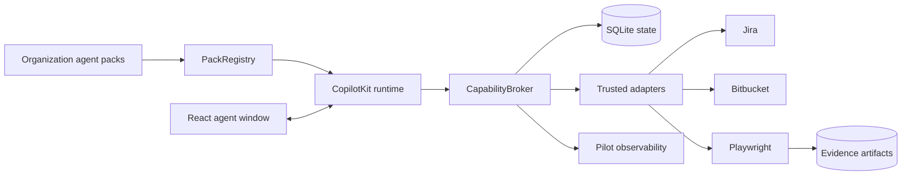

# BM Agents World documentation

> A governed platform for turning organization agent packs into runnable AI coworkers.

BM Agents World is an incubation repository for an agent experience built around **CopilotKit + AG-UI**, a reusable pack registry, and a governed capability layer. Its production-shaped vertical slice is the QA team pilot: it can read work context, select allowlisted tests, execute authenticated Playwright flows, preserve evidence, and create a Jira defect only after exact-artifact approval.


This portal is grounded in the repository. Live integration behavior depends on server-side configuration; several capabilities deliberately fall back to mocks.


## Choose a path

<a class="doc-card" href="getting-started/installation.html"><strong>Start developing</strong>Install, configure a model, and run the API and React UI.</a>
<a class="doc-card" href="architecture/system-architecture.html"><strong>Understand the system</strong>Follow requests through policy, adapters, persistence, and evidence.</a>
<a class="doc-card" href="features/qa-workbench.html"><strong>Explore the QA pilot</strong>Learn the real and mocked QA workflows and approval boundaries.</a>
<a class="doc-card" href="deployment/deployment.html"><strong>Operate the pilot</strong>Build and deploy the single-replica Kubernetes package safely.</a>
<a class="doc-card" href="development/testing-and-debugging.html"><strong>Test and debug</strong>Run policy tests, inspect runtime health, and diagnose governed actions.</a>
<a class="doc-card" href="development/api-reference.html"><strong>Use the API reference</strong>Find the real Express endpoints, authorization boundaries, and response behavior.</a>

## Platform at a glance

## What is live today?

| Area | Current implementation | Source |
|---|---|---|
| Agent experience | React 19, CopilotKit v2, AG-UI | `apps/agent-window/src/client/` |
| Agent definitions | Discovered from `packs/*-agent-pack` | `src/server/pack-registry.ts` |
| Governance | L0-L4 capabilities and payload-bound approvals | `src/server/platform/capability-broker.ts` |
| State | SQLite run, action, approval, audit, and evaluation state | `src/server/platform/capability-store.ts` |
| Integrations | Live Jira reads/writes, Bitbucket reads, Playwright; mock database and Teams | `src/server/qa/` |
| Deployment | Non-root Playwright image and Kubernetes base | `apps/agent-window/Dockerfile`, `deploy/k8s/qa-pilot/` |


The pilot is intentionally single-replica while SQLite and local filesystem artifacts are authoritative. It has no public Ingress. Trusted headers require an isolated trusted gateway.


Continue with [Application overview](getting-started/overview.md), then [Installation](getting-started/installation.md).
