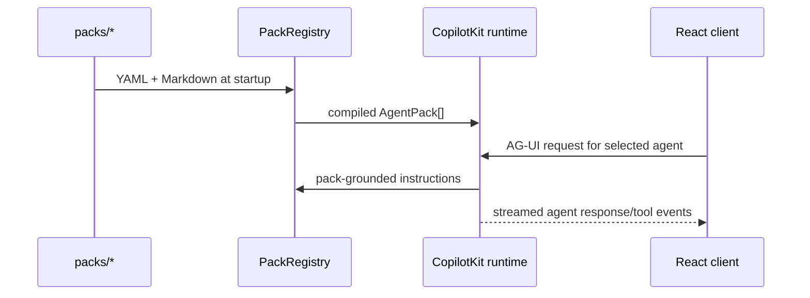

# Agent packs and CopilotKit

`PackRegistry` in `src/server/pack-registry.ts` discovers directories under `packs/`, parses each `config/pack-manifest.yaml`, agent registry, skill registry, workflows, and selected Markdown sources, then exposes safe public metadata. Startup fails early for malformed required pack material rather than silently inventing it.

`buildCopilotRuntime` in `src/server/copilot.ts` creates a global supervisor plus one named CopilotKit agent per pack. The pack prompt is grounded with its manifest, task groups, subagents, and source excerpts. The QA agent additionally receives governed tools from `src/server/qa/qa-tools.ts`.

To add a role, follow an existing pack's file inventory and registry schemas. Avoid adding role-specific branches to the core application unless the role needs a proven reusable product surface.
