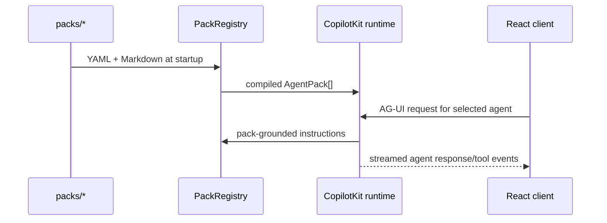

# Agent packs and CopilotKit

`PackRegistry` in `src/server/pack-registry.ts` discovers directories under `packs/`, parses each `config/pack-manifest.yaml`, agent registry, skill registry, workflows, and selected Markdown sources, then exposes safe public metadata. Startup fails early for malformed required pack material rather than silently inventing it.

`buildCopilotRuntime` in `src/server/copilot.ts` creates a global supervisor plus named CopilotKit agents. Each pack prompt is grounded with its manifest, task groups, subagents, and source excerpts.

The QA pack runs as a **multi-agent team** rather than a single flat agent: a `qa` supervisor coordinates the run, approvals, and consolidated result, alongside distinct, addressable specialist agents instantiated from the pack's agent registry — `qa.story-context`, `qa.change-impact`, `qa.test-design`, `qa.browser-qa`, `qa.api-qa`, `qa.database-validation`, `qa.integration-qa`, `qa.defect-investigator`, and `qa.qa-reporter`. Every QA agent receives the governed tools from `src/server/qa/qa-tools.ts`; each specialist's prompt scopes it to the capabilities it owns, while the capability broker enforces admission at runtime. Non-QA packs remain a single agent each.

To add a role, follow an existing pack's file inventory and registry schemas. Avoid adding role-specific branches to the core application unless the role needs a proven reusable product surface.
