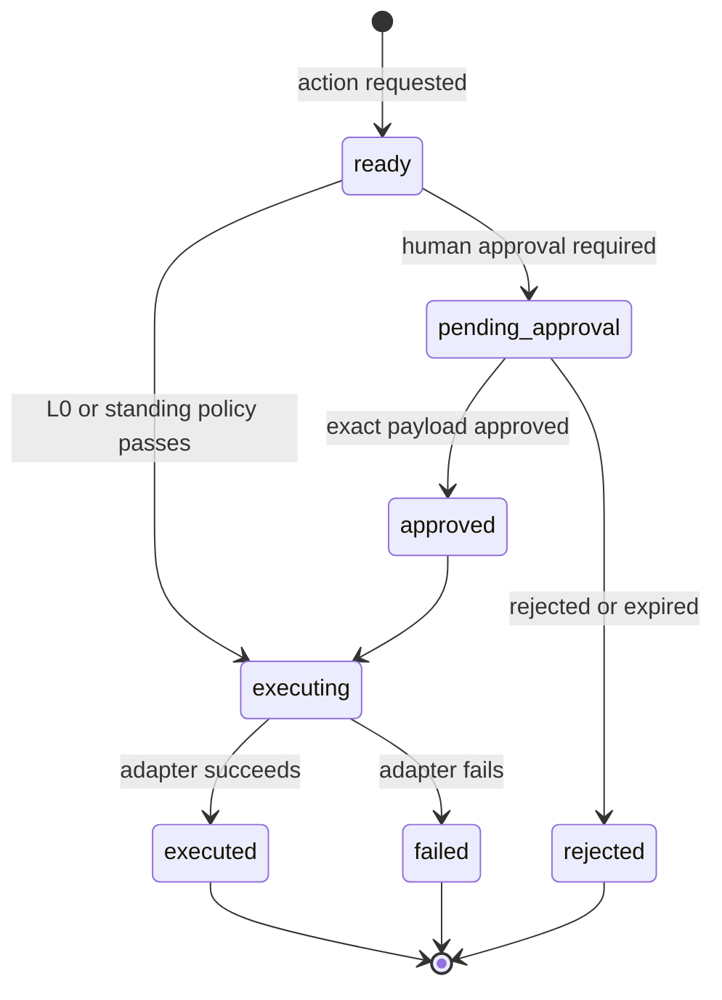

# Capability broker and data flow

`CapabilityBroker` is the policy choke point between model-requested tools and adapters. Capability definitions in `src/server/qa/qa-capabilities.ts` declare risk, approval mode, allowed environments, side-effect class, and adapter ID.

Payloads receive a stable hash. Human approval is bound to that hash and expires; changing the payload requires a new action. The broker also rejects unsupported production mutation, unregistered adapters, and disallowed environments, and records audit events for requests, decisions, execution, denial, and failure.

| Capability | Risk | Approval | Implementation |
|---|---:|---|---|
| Jira story read | L0 | none | live with mock fallback |
| Jira duplicate search | L0 | none | live with mock fallback |
| Bitbucket change impact | L0 | none | live with mock fallback |
| Database validation | L0 | none | mock |
| Playwright test run | L1 | standing policy | live non-production or mock |
| Jira bug create | L3 | human | live opt-in or mock |
| Teams status post | L3 | human | mock |

New capabilities require a definition, adapter, tool binding, tests for denial/approval behavior, and documentation of the side-effect boundary.
