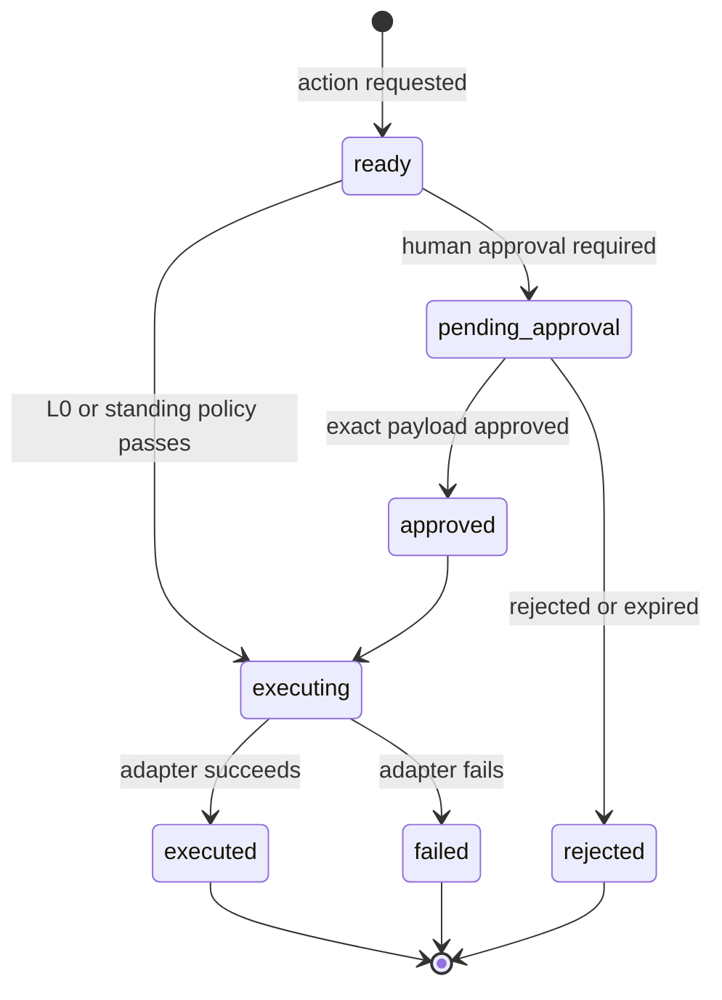

# Capability broker and data flow

`CapabilityBroker` is the policy choke point between model-requested tools and adapters. Capability definitions in `src/server/qa/qa-capabilities.ts` declare risk, approval mode, allowed environments, side-effect class, and adapter ID.

Payloads receive a stable hash. Human approval is bound to that hash and expires; changing the payload requires a new action. The broker also rejects unsupported production mutation, unregistered adapters, and disallowed environments, and records audit events for requests, decisions, execution, denial, and failure.

| Capability | Risk | Approval | Implementation |
|---|---:|---|---|
| Jira story read | L0 | none | live with mock fallback |
| Jira duplicate search | L0 | none | live with mock fallback |
| Bitbucket change impact | L0 | none | live with mock fallback |
| Test plan generate | L0 | none | live — persists an immutable, story-scoped test-plan artifact |
| Database validation | L0 | none | live opt-in allowlisted read-only SQL, or honest mock |
| Integration trace | L0 | none | live — persists a run-scoped traceability artifact |
| Playwright test run | L1 | standing policy | live non-production or mock |
| API contract test | L1 | standing policy | live allowlisted read-only checks, or honest mock |
| Jira bug create | L3 | human | live opt-in or mock |
| Teams status post | L3 | human | live approved webhook, or honest mock |

The full, always-current list — including descriptions, allowed environments, adapter IDs, and the approved connectors that admit each capability — is generated in the [capability and connector catalog](../generated/capability-catalog.md).

Capabilities that never have a live adapter are hidden from the agent by default (`availableQaCapabilities`) so it cannot advertise or "report" simulated work; each is reachable behind an explicit opt-in flag. Executor capabilities degrade to an honest mock (never a fabricated success) when their integration is not configured.

Two workflow invariants are enforced server-side, not merely by prompt:

- **Same-run bug draft.** `qa.jira.duplicate.search` and `qa.jira.bug.create` require the referenced bug-draft artifact to belong to the current run. Bug drafts are produced only by `qa.playwright.test.run`, so a matching run proves a real test run generated the draft. The check fails closed at the review card and at execute, before any Jira call.
- **Allowlisted execution.** The database, API-contract, and Playwright executors run only server-curated, allowlisted work (named SQL validations, contract IDs, or test suites). The model supplies an identifier, never SQL, URLs, selectors, or scripts.

New capabilities require a definition, adapter, tool binding, an entry in the approved connector registry, tests for denial/approval behavior, and documentation of the side-effect boundary.
