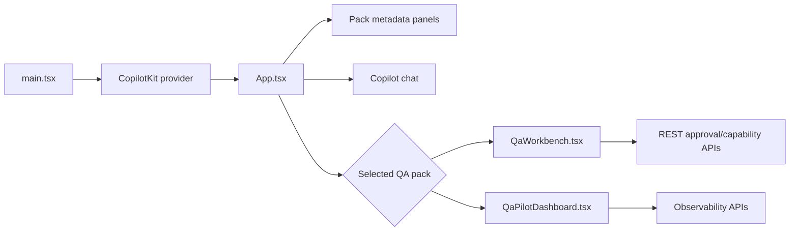

# Frontend, routing, and state

The frontend is React 19 mounted by `src/client/main.tsx`. `CopilotKit` wraps the application with runtime URL `/api/copilotkit` and agent `default`. `App.tsx` lists packs, loads the selected pack, switches CopilotKit agents, and renders pack metadata and chat.

There is **no client routing library**. Navigation is view state inside components, so refreshing returns to the default experience. Data is fetched directly with the browser `fetch` API; there is no global data cache or Redux-style state store.

Component-local loading and error flags guard each fetch. When adding a new page-like surface, decide whether ephemeral component state is sufficient; a real URL router would be a new architectural choice and should be documented with tests.
