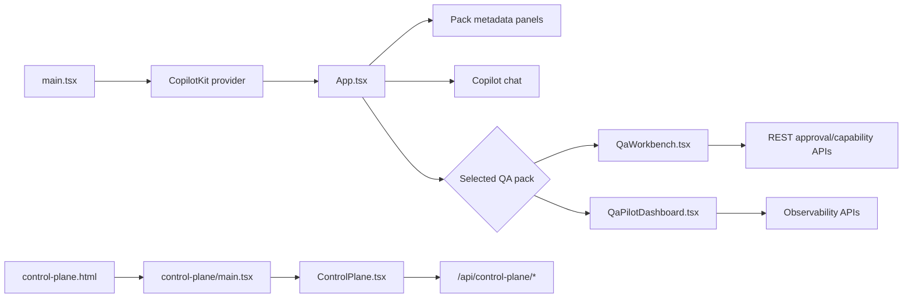

# Frontend, routing, and state

The frontend is React 19 mounted by `src/client/main.tsx`. `CopilotKit` wraps the application with runtime URL `/api/copilotkit` and agent `default`. `App.tsx` lists packs, loads the selected pack, switches CopilotKit agents, and renders pack metadata and chat.

There is **no client routing library**. Navigation is view state inside components, so refreshing returns to the default experience. Data is fetched directly with the browser `fetch` API; there is no global data cache or Redux-style state store.

## Two independent entries

The build has two pages, not one. `index.html` mounts the agent lab described above. `control-plane.html` mounts the operator console (`src/client/control-plane/`), which imports **no CopilotKit provider and mounts no agent runtime**.

That separation is deliberate rather than incidental. Governance posture and pending approvals are most worth reading when the runtime is unavailable, so the console must not share the runtime's fate; it reaches the server only through `/api/control-plane/*`. The same property lets the console be typechecked on its own (`npm run typecheck:control-plane`) in environments where the CopilotKit v2 packages cannot resolve. `App.tsx` links to the console with a plain anchor — never an import — so the dependency stays one-way.

Component-local loading and error flags guard each fetch. When adding a new page-like surface, decide whether ephemeral component state is sufficient; a real URL router would be a new architectural choice and should be documented with tests.
