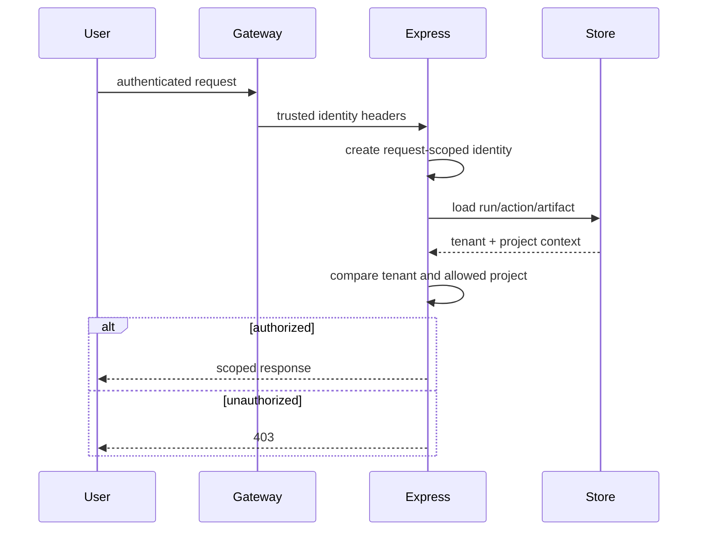

# Identity and authorization

Identity is established by `src/server/platform/request-identity.ts` and stored per request with `AsyncLocalStorage`. Development uses configured local defaults. Shared pilot mode requires `BM_IDENTITY_MODE=trusted-headers`; a trusted gateway must inject `x-user-id`, `x-tenant-id`, and project IDs.

An identity can access an execution only when tenant IDs match and its project list contains the project (or `*`). Run, action, audit, artifact, and observability routes enforce this check. In trusted mode, missing identity context never falls back to local identity. A requester cannot approve their own L3 action.


Headers are not authentication by themselves. Never expose the service directly when trusted-header mode is enabled. The Kubernetes NetworkPolicy is part of the security boundary.

