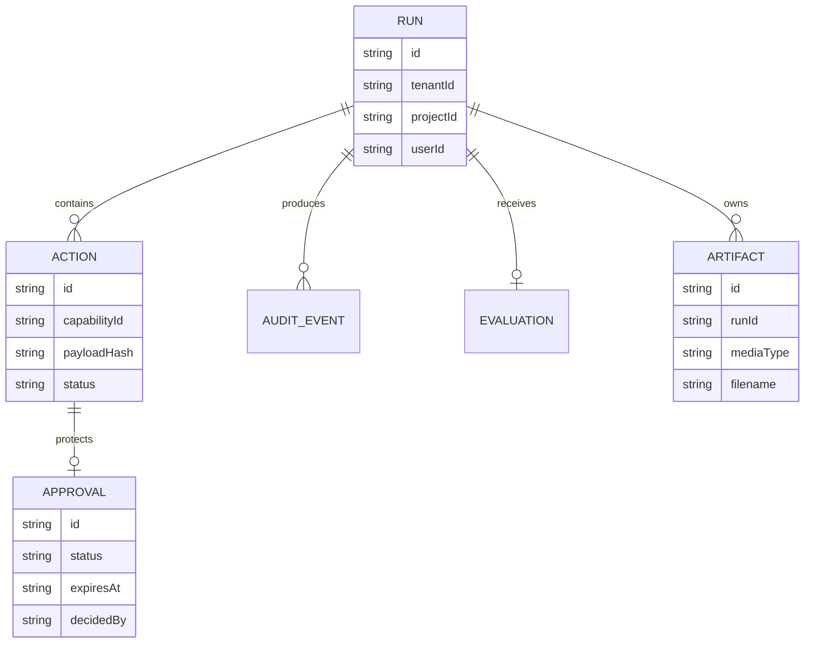

# Persistence and artifacts

`SqliteCapabilityStore` in `src/server/platform/capability-store.ts` persists runs, actions, approvals, and audit events. `QaPilotObservabilityStore` uses the same database path for evaluations and derives operational metrics from persisted facts. `ArtifactStore` writes evidence beneath `BM_ARTIFACT_ROOT` and stores a metadata record beside each file.

Artifact download first resolves metadata, then re-authorizes the owning run. Responses use `private, no-store`, `nosniff`, and controlled content disposition. Run deletion and retention are not implemented; operators must treat disk sizing and backup as pilot responsibilities.

SQLite plus local artifacts require one replica with `Recreate`. Move to shared Postgres/Supabase and object storage before horizontal scaling.
