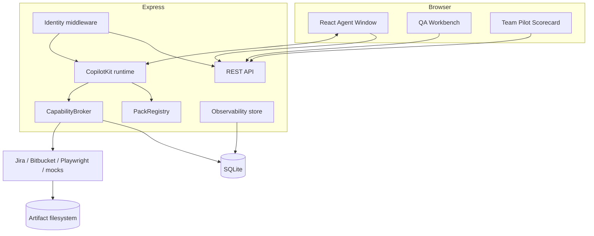

# System architecture

The application is a two-process development system and a single HTTP service in production. Express serves APIs, the CopilotKit endpoint, and the built Vite assets. It composes a pack registry, capability broker, persistent store, artifact store, observability store, and trusted adapters at module startup.

`src/server/index.ts` is the authoritative assembly. Health probes precede identity middleware and expose no project data. Every other route receives request-scoped identity. Production static assets are served only when `dist/client` exists.

The architecture intentionally keeps pack content declarative and execution capabilities centralized. This allows another pack to reuse governance without copying the QA implementation.
