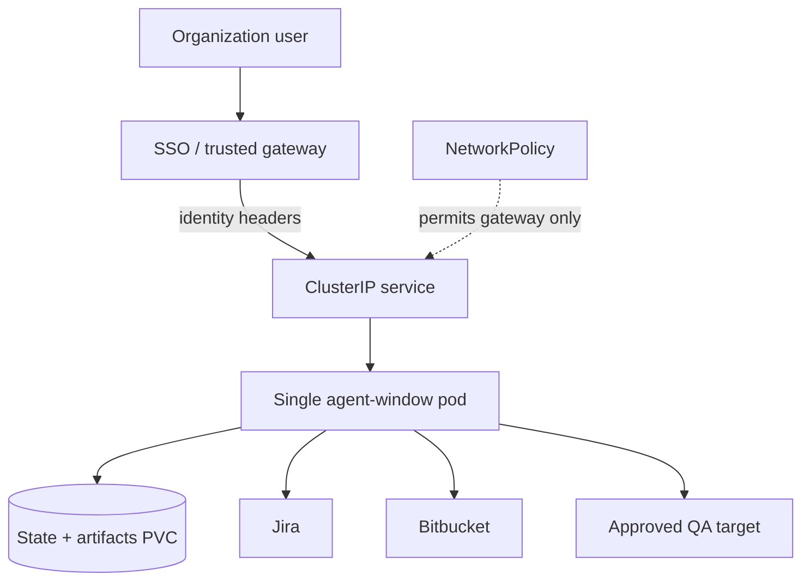

# Deployment

The pilot is packaged as a multi-stage Docker image and Kubernetes Kustomize base in `deploy/k8s/qa-pilot/`. The runtime is the exact Playwright 1.62 browser image, runs as `pwuser`, and exposes port 4000.

```bash
docker build -f apps/agent-window/Dockerfile -t bm-agents-world:qa-pilot .
kubectl apply -k deploy/k8s/qa-pilot
```



The deployment uses one replica, `Recreate`, a PVC, read-only root filesystem, dropped Linux capabilities, seccomp, `/tmp` and `/dev/shm` ephemeral volumes, and an optional Playwright auth secret. Startup/liveness call `/healthz`; readiness calls `/readyz`.

There is intentionally no Ingress. Before admission, verify a NetworkPolicy-enforcing CNI, trusted gateway namespace/pod labels, secrets, writable persistence, model provider, Jira/Bitbucket, and Playwright configuration. Follow the [Team pilot deployment runbook](../qa-team-pilot-deployment.md).
