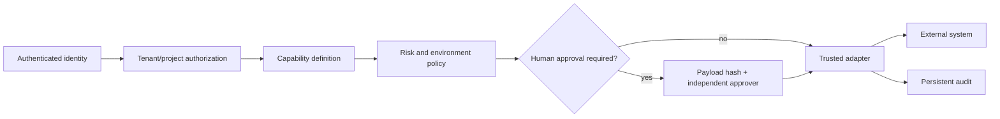

# Security

The core security invariant is: **model intent never directly becomes an external side effect**.

Protected controls include request-scoped trusted identity, tenant/project resource checks, production-mutation denial, environment allowlists, immutable payload hashes, expiring approval contracts, self-approval denial, server-side secrets, bounded HTTP, run-scoped artifacts, non-root containers, and gateway-only network ingress.

External execution is further constrained by **server-curated allowlists**: database validations (named read-only SQL), API contract checks (fixed endpoints), and browser suites are all authored server-side. The model supplies only an identifier — never SQL, URLs, selectors, or scripts. The Teams webhook is restricted to approved Teams / Power Automate hosts. Capabilities without a live adapter are hidden from the agent by default, and every executor degrades to an honest mock rather than a fabricated success when its integration is not configured. Bug creation additionally requires a bug draft produced by a real test run in the same run.

Known limitations: SQLite/local files prevent horizontal scale and must not back multiple pods; retention and automated backups are not implemented in code; live integrations (Jira/Bitbucket/Playwright/Teams/database/API) are only exercised when explicitly configured, and readiness does not prove remote credentials or targets actually work.

Never put production credentials in docs, pack prompts, action payloads, client state, logs, or evidence artifacts.
