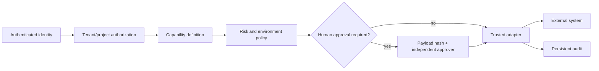

# Security

The core security invariant is: **model intent never directly becomes an external side effect**.

Protected controls include request-scoped trusted identity, tenant/project resource checks, production-mutation denial, environment allowlists, immutable payload hashes, expiring approval contracts, self-approval denial, server-side secrets, bounded HTTP, allowlisted browser steps, run-scoped artifacts, non-root containers, and gateway-only network ingress.

Known limitations: SQLite/local files prevent horizontal scale; database and Teams capabilities are mocks; OPA is not yet the centralized runtime evaluator; model usage and OpenTelemetry are not persisted; retention and automated backups are not implemented in code.

Never put production credentials in docs, pack prompts, action payloads, client state, logs, or evidence artifacts.
