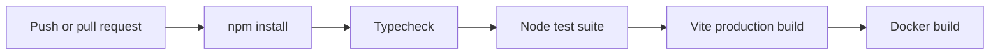

# Build and CI

`npm run build` delegates to the app workspace, runs strict typecheck, then creates the Vite production bundle in `apps/agent-window/dist/client`. Express serves this directory when present.

The bundle has **two entries**: `index.html` (the agent lab) and `control-plane.html` (the operator console). They are independent — the console imports no agent runtime — so a failure to resolve the CopilotKit packages breaks the lab entry without making the console unbuildable. `npm run typecheck:control-plane` in the app workspace compiles the console on its own and is the check that keeps that isolation real rather than assumed.

The `Agent Window CI` workflow runs on pushes to `main` and `agent/**`, and relevant pull requests. It installs on Node 22, typechecks, runs policy/integration/deployment/observability tests, builds the application, then builds the pilot container.

`qa-pilot-image.yml` is the separate manual image publication workflow. Documentation is built independently from `docs/` and validated by the `Documentation Integrity` workflow.

## Documentation integrity

`.github/workflows/docs-integrity.yml` runs for every pull request and every push to `main`. It regenerates factual reference pages, fails when generated output was not committed, checks changed source paths against `docs/doc-impact-map.yaml`, and builds the HonKit portal.

Generated pages under `docs/generated/` are derived from repository sources and must not be edited directly. Narrative architecture, security, feature, and operations pages remain human-owned. When a mapped source changes, at least one mapped narrative page must change unless a maintainer applies the `docs-not-needed` label and provides a documentation-impact explanation in the pull request.
