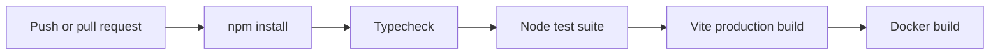

# Build and CI

`npm run build` delegates to the app workspace, runs strict typecheck, then creates the Vite production bundle in `apps/agent-window/dist/client`. Express serves this directory when present.

The `Agent Window CI` workflow runs on pushes to `main` and `agent/**`, and relevant pull requests. It installs on Node 22, typechecks, runs policy/integration/deployment/observability tests, builds the application, then builds the pilot container.

`qa-pilot-image.yml` is the separate manual image publication workflow. Documentation is currently built independently from `docs/`; adding docs CI is a recommended follow-up, not an existing repository behavior.
