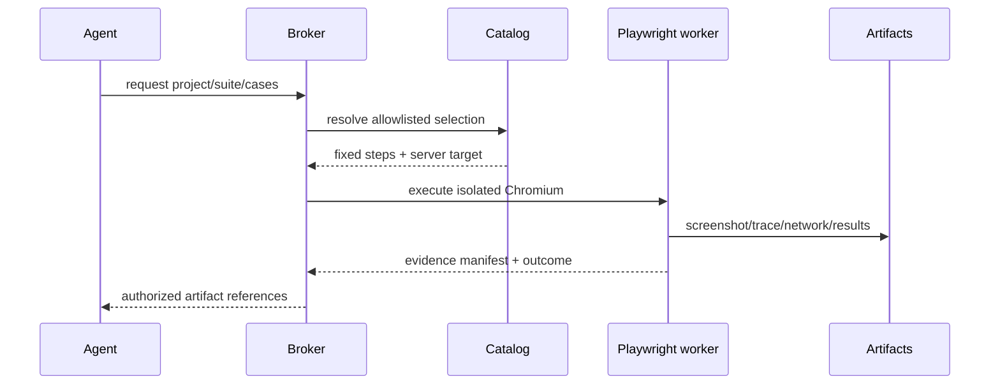

# Authenticated browser testing

`PlaywrightWorkerAdapter` executes only catalog-defined suites from `apps/agent-window/config/qa-project-tests.yaml`. The model selects semantic inputs; it cannot provide arbitrary browser code or a target URL. `resolveProjectTestSelection` validates project, suite, cases, tags, and configured environment.

Production is excluded by the capability definition. Authentication state is a secret file referenced by an environment-variable name in the catalog; its contents are never returned. The deployment provides `/dev/shm`, temporary storage, a non-root user, and the exact Playwright browser image version.
