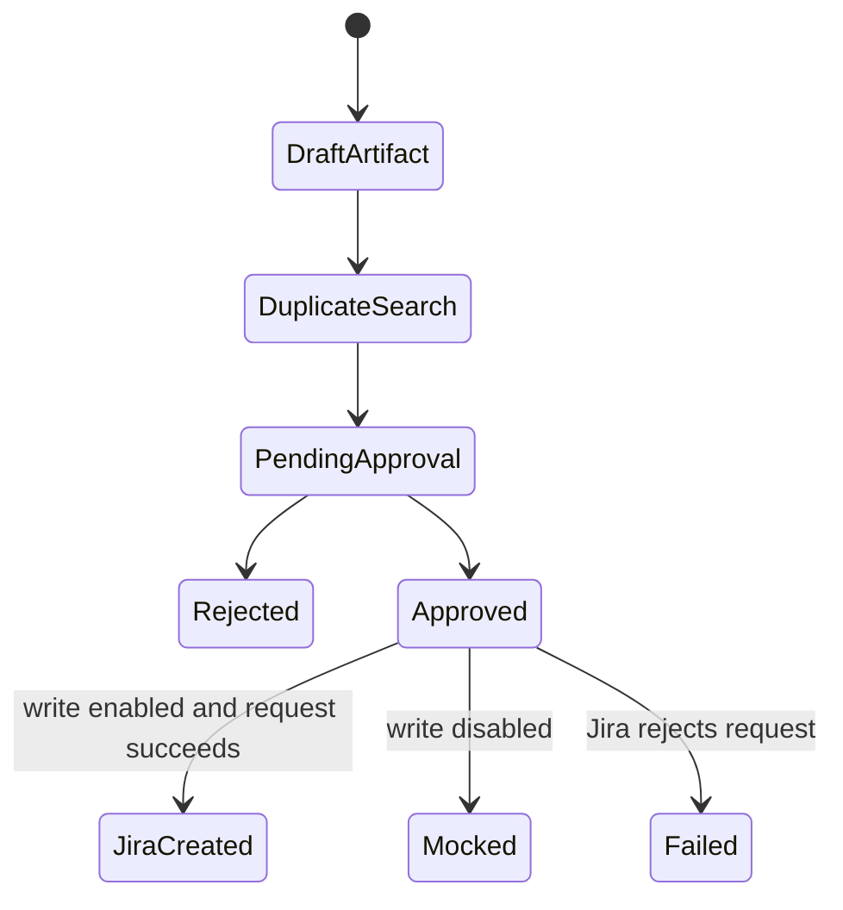

# Jira defect workflow

Jira defect creation is an L3 external write in `jira-defect-adapter.ts`. A browser failure first produces an immutable bug-draft artifact. Duplicate search is read-only. Review resolves the exact Jira project, issue type, summary, description, labels, and source evidence before approval.

Approval is tied to the action's payload hash. In trusted identity mode the requester must be different from the approver. Live writing also requires `QA_JIRA_WRITE_ENABLED=true`; otherwise the adapter returns mock behavior without an external side effect.

Never describe `executed` as a confirmed Jira write without checking `result.externalSideEffect` and the returned issue details.
