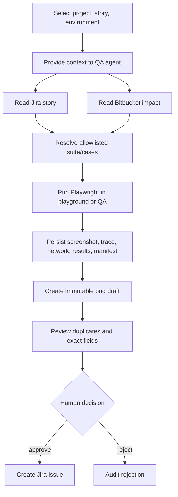

# QA workbench

`src/client/QaWorkbench.tsx` appears for the QA pack. It loads capability and integration status, shares selected story/project/environment context with CopilotKit, and renders protected-action review controls.

The browser does not hold integration credentials. It receives statuses and action records only. Approval calls may fail with 409 if state changed, the payload expired, or self-approval is denied.
