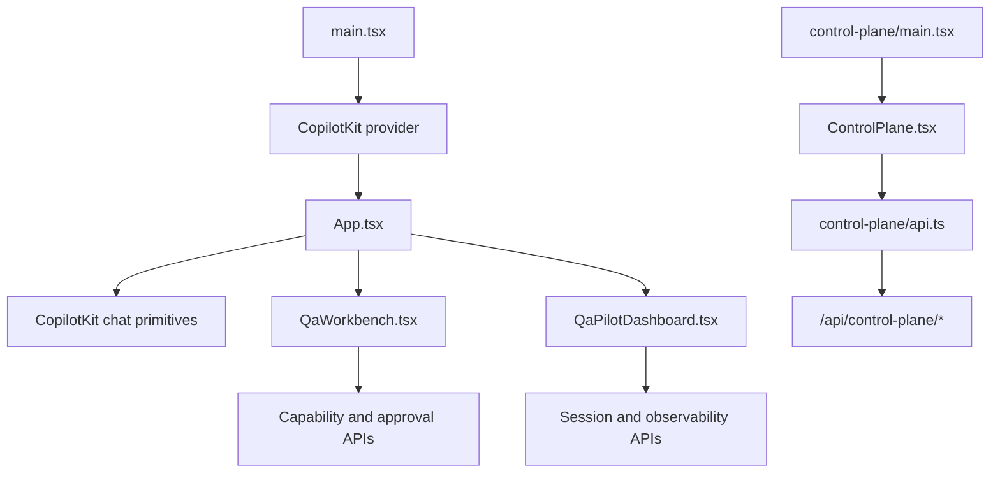

# Frontend component system

The frontend is intentionally small and product-oriented rather than a general-purpose component library. Six React modules own the visible application experience across two independent entries; CSS is split by surface. There are no Storybook stories or reusable design-system package in the current repository.

## Component relationships

The two entries never import each other. `App.tsx` reaches the console through a plain `<a href="/control-plane.html">`, which is what keeps the console free of the agent runtime.

## Major components

| Component | Location | Responsibility | State and dependencies |
|---|---|---|---|
| `App` | `apps/agent-window/src/client/App.tsx` | Pack discovery, selection, metadata, task launch, and chat shell | Local selection/loading/error state; CopilotKit agent switching; `/api/packs` |
| `QaWorkbench` | `apps/agent-window/src/client/QaWorkbench.tsx` | QA context, capability status, action review, and approval controls | Local form/action state; CopilotKit tools; capability/action APIs; Zod |
| `QaPilotDashboard` | `apps/agent-window/src/client/QaPilotDashboard.tsx` | Pilot summary, recent runs, filters, and human evaluation | Local filter/loading/evaluation state; session and observability APIs |
| `main` | `apps/agent-window/src/client/main.tsx` | React mount and CopilotKit provider configuration | Runtime URL `/api/copilotkit`; default agent; top-level error handler |
| `ControlPlane` | `apps/agent-window/src/client/control-plane/ControlPlane.tsx` | Operator console: posture, capabilities, agents and grants, approvals | Local tab/filter state and one `useControlPlane` hook; `/api/control-plane/*` only; **no CopilotKit** |
| `control-plane/main` | `apps/agent-window/src/client/control-plane/main.tsx` | Standalone React mount for `control-plane.html` | No provider, no agent runtime |

## State ownership

State stays close to the surface that renders it. `App` owns the selected pack; `QaWorkbench` owns QA inputs and protected-action review state; `QaPilotDashboard` owns scorecard filters and evaluations. CopilotKit supplies agent runtime state. There is no Redux, Zustand, React Context owned by this repository, client router, or query cache.

`ControlPlane` owns only presentation state — the active tab and its filters. Every governance judgement it displays (posture level, risk ordering, which agents may request a capability, how long an approval has waited) is computed server-side and rendered verbatim, so the console cannot drift from what the platform would actually enforce.

## Styling

`styles.css` defines the agent-window shell. `qa-workbench.css` and `pilot-dashboard.css` scope the QA workbench and scorecard. `control-plane/control-plane.css` styles the console; it shares the product's dark palette but reserves colour for risk and posture, so colour always carries meaning there. When adding UI, keep surface-specific styles with the owning component and preserve native controls, focus visibility, loading states, empty states, and conflict/error feedback.

## Adding a component

1. Decide which existing product surface owns the state.
2. Keep credentials and integration configuration out of props and browser state.
3. Use an existing authorized API rather than bypassing the capability broker.
4. Add loading, empty, error, and authorization-denied behavior.
5. Add component tests if a frontend test harness is introduced; none exists today.

Continue with [Frontend, routing, and state](../architecture/frontend.md) or [QA workbench](../features/qa-workbench.md).
