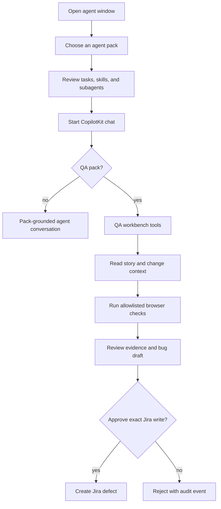

# Application overview

BM Agents World converts the declarative material in `packs/` into runnable agent experiences without hard-coding a separate application for every role. The current application, `apps/agent-window`, is both the general pack browser/chat shell and the home of a deeply implemented QA pilot.

## Main user journeys

The React shell is in `apps/agent-window/src/client/App.tsx`. The API composition root is `apps/agent-window/src/server/index.ts`. The pack compiler is `src/server/pack-registry.ts`; governed execution lives under `src/server/platform/`; QA adapters live under `src/server/qa/`.

## Current scope

Live implementations exist for Jira story reads, Jira duplicate search and approved defect creation, Bitbucket change-impact reads, and authenticated non-production Playwright runs. Database validation and Teams posting are explicit mocks. The repository contains no client-side router and no Redux-like store; view selection and dashboard state are React component state.

## Read next

Use [Project structure](project-structure.md) for the file map or [System architecture](../architecture/system-architecture.md) for the runtime relationships.
